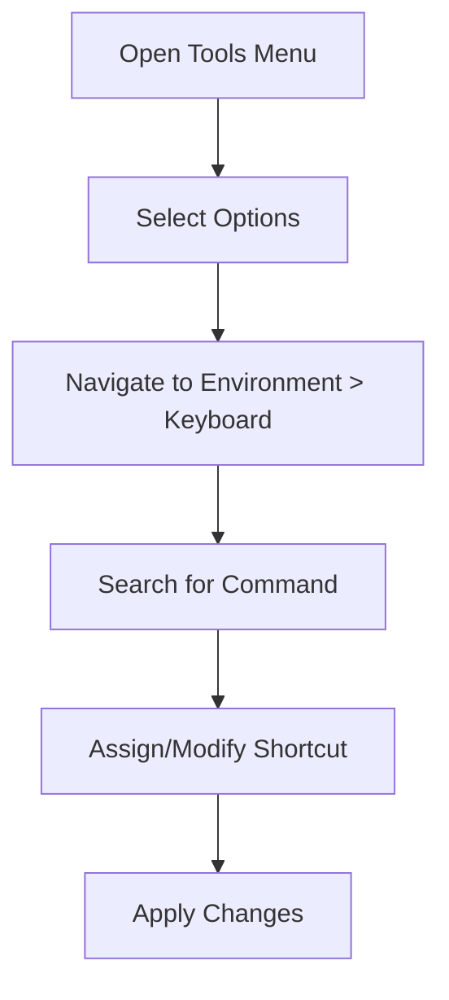

# Visual Studio Keyboard Shortcuts

This page provides a quick reference for common keyboard shortcuts in Visual Studio. These shortcuts can help you navigate, edit, debug, and manage your development environment more efficiently.

:::tip
Memorizing these shortcuts can significantly boost your productivity in Visual Studio!
:::

## Navigation

| Shortcut | Description |
|----------|-------------|
| `Ctrl + T` | Go to All (search for files, types, members, symbols) |
| `Ctrl + ,` | Navigate To |
| `F12` | Go to Definition |
| `Alt + F12` | Peek Definition |
| `Ctrl + -` | Navigate Backward |
| `Ctrl + Shift + -` | Navigate Forward |

## Editing

| Shortcut | Description |
|----------|-------------|
| `Ctrl + K, Ctrl + C` | Comment selected lines |
| `Ctrl + K, Ctrl + U` | Uncomment selected lines |
| `Ctrl + K, Ctrl + D` | Format document |
| `Ctrl + .` | Quick Actions and Refactorings |
| `Alt + Up/Down` | Move current line up/down |
| `Ctrl + L` | Cut current line |

## Debugging

| Shortcut | Description |
|----------|-------------|
| `F5` | Start Debugging |
| `Shift + F5` | Stop Debugging |
| `F9` | Toggle Breakpoint |
| `F10` | Step Over |
| `F11` | Step Into |
| `Shift + F11` | Step Out |

## Window Management

| Shortcut | Description |
|----------|-------------|
| `Ctrl + Alt + L` | Solution Explorer |
| `Ctrl + \, T` | Open new terminal |
| `Ctrl + Q` | Quick Launch |
| `Alt + W, L` | Close all windows |

:::note
Some shortcuts may vary depending on your Visual Studio version and configuration.
:::

## Customizing Shortcuts

You can customize keyboard shortcuts in Visual Studio:

1. Go to `Tools` > `Options`
2. Navigate to `Environment` > `Keyboard`
3. Search for the command you want to modify
4. Assign a new shortcut or modify existing ones

For more information on customizing shortcuts, check out the [official Visual Studio documentation](https://docs.microsoft.com/en-us/visualstudio/ide/identifying-and-customizing-keyboard-shortcuts-in-visual-studio).